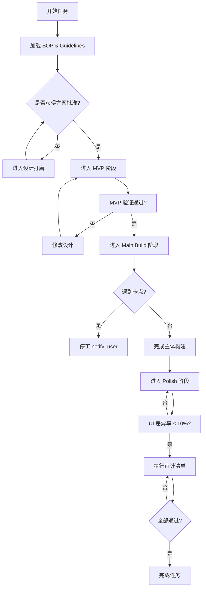

# 🚀 项目流程优化规范 (Project SOP)

> [!IMPORTANT]
> **AI 必读执行手册**：本文档定义了项目的"铁律"与"标准动作"。每一轮任务开始前，AI 必须完整阅读本文档并在执行过程中严格遵循。
> **核心理念**：打磨 -> 验证 -> 迭代，不允许跳过任何检查点。

---

## 📋 AI 执行前必须完成的动作清单

在开始任何任务前，AI 必须依次执行以下动作：

```
□ 1. 加载项目 SOP：读取本文档全文
□ 2. 加载 Guidelines：读取 docs/AI助手开发准则与要求(Guidelines).md
□ 3. 加载交接快照：读取 docs/Agent_Handover_Context(项目交接快照).md
□ 4. 检查任务追踪：读取 docs/任务追踪(Task).md 确认当前进度
□ 5. 对齐 SOP 要求：在 TodoWrite 中记录本任务的 SOP 检查点
```

> ⚠️ **警告**：上述动作是强制性的。未完成清单检查就直接写代码属于违规行为。

---

## 1. 深度打磨的设计文档 (Design Standards - PSB Plan)

设计文档不再仅仅是逻辑描述，必须包含以下"可视化"与"防御性"要素：

### 1.1 必需内容清单

| 序号 | 内容项 | 说明 | 验收标准 |
|:---:| :--- | :--- | :--- |
| 1 | **技术选型明细** | 明确库版本、核心架构决策及理由 | 必须包含具体版本号（如 `Room 2.6.1`） |
| 2 | **功能实现深度图解** | 使用 Mermaid 或表格描述复杂状态流转 | 状态机/流程图必须能直接指导编码 |
| 3 | **UI Mockup/原型** | 每个核心页面生成 UI 点击原型或 Mockup 图片 | 必须使用 `generate_image` 或 Web 模拟生成 |
| 4 | **UI 表格化描述** | 使用表格详细列出每个 UI 组件的属性 | 包含：颜色、字体、间距、状态 |
| 5 | **AI 挑战记录** | 主动发起"挑战模式"寻找设计漏洞 | 必须包含至少 3 个挑战问答 |

### 1.2 设计文档模板

```markdown
# 📄 [功能名称] 设计文档

## 1. 技术选型
- **依赖库**: [库名@版本号]
- **架构决策**: [为什么选择这个方案]
- **替代方案**: [考虑过的其他方案及放弃理由]

## 2. 功能实现图解
<!-- 在此插入 Mermaid 状态机或流程图 -->

## 3. UI 布局
### 3.1 页面结构
<!-- 在此插入 UI Mockup 图片 -->

### 3.2 组件清单
| 组件名 | 类型 | 属性 | 状态 |
|:---|:---|:---|:---|
| xxx | Button | color=#FF0000, size=48dp | default/pressed/disabled |

## 4. AI 挑战记录
- **挑战1**: [问题描述] -> [结论]
- **挑战2**: [问题描述] -> [结论]
- **挑战3**: [问题描述] -> [结论]

## 5. 风险评估
| 风险点 | 影响程度 | 缓解措施 |
|:---|:---|:---|
| xxx | 高/中/低 | xxx |
```

### 1.3 多轮打磨流程

```
[初稿] → [用户评审] → [修正] → [终稿批准]
   ↑                                    |
   └────────────────────────────────────┘
                    ↓
           禁止进入 EXECUTION
```

> ⚠️ **红线**：未获得用户明确的"方案批准"（通过 `notify_user` 确认），严禁进入代码编写阶段。

---

## 2. 并行与分阶段构建 (Build - Swarm Mode & Parallelism)

严禁"一次性交付大功能"，必须遵循"分治法"解耦规划与执行：

### 2.1 编排与多代理协同 (Orchestration Swarm)

| 角色 | 职责 | 模型建议 | 产出 |
|:---|:---|:---|:---|
| **编排员 (Orchestrator)** | 全局任务分解、跨组件设计方案打磨、技术选型 | Opus 4.5 | 详细的实施计划（Implementation Plan） |
| **执行员 (Executor)** | 专注于单一 Sub-task，在隔离区内高强度代码实现 | Sonnet | 单一模块的完整代码 |

> 📌 **执行规则**：
> - 编排员必须先创建 Implementation Plan，明确各模块间的契约（Interface/Contract）
> - 执行员只能在编排员划定的"隔离区"内工作，禁止跨模块修改
> - 使用 Git Worktree 进行隔离开发（详见 2.2）

### 2.2 分布式执行 (Git Worktree Parallelism)

**强制使用 Git Worktree 的场景**：
- 需要同时开发相互独立的模块（如：一个写后端 logic，一个写 Compose UI）
- 需要为某个功能创建隔离的测试环境
- 需要在不影响主分支的情况下进行破坏性重构

**Git Worktree 操作规范**：

```powershell
# 1. 检查并创建 worktree 目录（如果不存在）
$worktreeDir = ".worktrees"
if (-not (Test-Path $worktreeDir)) {
    New-Item -ItemType Directory -Path $worktreeDir
}

# 2. 验证目录已被 gitignore
git check-ignore -q $worktreeDir || Write-Host "ERROR: 目录未被 gitignore"

# 3. 创建 worktree（使用 -b 创建新分支）
git worktree add "$worktreeDir/feature-xxx" -b "feature/xxx"

# 4. 进入 worktree 并验证环境
cd "$worktreeDir/feature-xxx"
# 运行测试确保基线干净
```

> ⚠️ **红线**：
> - 每个 Agent 实例必须在独立的 Worktree 下运行
> - 通过独立的 branch 进行提交
> - 合并前必须进行"合并审计"（详见 2.4）

### 2.3 分阶段交付节奏 (Phased Milestones)

AI Agent 在执行任务时必须严格按以下四个阶段推进，**严禁跨阶段作业**：

#### 阶段一：Orchestrate (深度编排与对齐)

| 检查项 | 动作 | 验收标准 |
|:---|:---|:---|
| 1 | 加载 brainstorming 或 requirements-designer Skill | Skill 已加载 |
| 2 | 对原始需求进行"脱水"与"拆解" | 产出 Sub-task 列表 |
| 3 | 生成技术实现方案 | 方案包含技术选型 |
| 4 | 生成 UI 布局预览 | Web 原型或 Mockup 图片 |
| 5 | **请求用户打磨确认** | 获得"方案批准" |

> 📌 **红线**：必须通过 `notify_user` 请求用户进行至少一轮"打磨"确认。未获得明确的"方案批准"前，严禁进入代码编写。

#### 阶段二：MVP (核心逻辑验证)

| 检查项 | 动作 | 验收标准 |
|:---|:---|:---|
| 1 | 忽略视觉效果，只实现 Happy Path | 核心业务流程跑通 |
| 2 | 编写 TDD 测试 | 测试覆盖核心逻辑 |
| 3 | 运行测试并通过 | 测试 Pass |
| 4 | 对比实际效果与原始设计 | 记录差异点 |
| 5 | **向用户汇报验证结论** | 确认是否需要调整设计 |

> 📌 **自省机制**：MVP 运行通过后，Agent 必须对比实际执行效果与原始设计。若发现性能、复杂度或交互逻辑不符预期，**必须立即反向修改设计文档**。

#### 阶段三：Main Build (主体业务构建)

| 检查项 | 动作 | 验收标准 |
|:---|:---|:---|
| 1 | 实现剩余 80% 业务逻辑 | 代码覆盖完整 |
| 2 | 实现错误处理 | 各异常场景有对应处理 |
| 3 | 实现数据持久化 | 数据可正确保存/读取 |
| 4 | 遇到卡点立即停工 | 不能用 Placeholder 跳过 |

> 📌 **红线**：遇到"无法实现"、"实现极难"或"按文档走会很别扭"的情况时，**严禁使用 Placeholder 跳过或强行蛮力破解**。必须立即调用 `notify_user` 向用户说明卡点原因。

#### 阶段四：Polish (像素级对齐与动效打磨)

| 检查项 | 动作 | 验收标准 |
|:---|:---|:---|
| 1 | 对齐颜色、间距、字体 | 与设计稿一致 |
| 2 | 添加微动效 | 符合 Material 3 规范 |
| 3 | 生成最终效果图 | Web 模拟或 generate_image |
| 4 | **自查差异率** | 差异率 ≤ 10% |

> 📌 **红线**：自查生成的 UI 与设计阶段的预览图。**差异率必须控制在 10% 以内**，否则必须反复迭代直至完美对齐。

### 2.4 合并审计 (Merge Audit)

所有 Worktree 的产出最终在主工作区通过交互式 `git merge` 或 `rebase` 进行集成：

```
┌─────────────┐     ┌─────────────┐     ┌─────────────┐
│  Worktree A │     │  Worktree B │     │  Worktree C │
│  (feature/1)│     │  (feature/2)│     │  (feature/3)│
└──────┬──────┘     └──────┬──────┘     └──────┬──────┘
       │                   │                   │
       └───────────────────┼───────────────────┘
                           │
                    ┌──────▼──────┐
                    │  合并审计    │
                    │  (人工确认)  │
                    └─────────────┘
```

> ⚠️ **强制审计清单**：
> - [ ] 检查是否有未解决的冲突
> - [ ] 检查新增代码是否遵循项目规范
> - [ ] 运行完整测试套件确保无回归
> - [ ] 检查 commit 消息是否符合规范

---

## 3. 限制级测试文档 (Rigid Testing Workflow)

测试文档必须能够作为"功能红线"约束开发：

### 3.1 测试文档结构要求

```markdown
# 📋 [功能名称] 测试用例文档

## 1. 测试目标
- 验证 [功能名称] 的核心功能
- 确保符合需求设计文档中的规范

## 2. 测试环境
- 设备: Android 14 (API 34)
- 测试框架: Robolectric + Compose UI Test

## 3. 测试用例
### 3.1 Happy Path
| TC ID | 测试场景 | 预期结果 | 状态 |
|:---|:---|:---|:---|
| TC-001 | [场景描述] | [预期结果] | Pass/Fail |

### 3.2 异常场景
| TC ID | 测试场景 | 预期结果 | 状态 |
|:---|:---|:---|:---|
| TC-E01 | [异常场景描述] | [预期错误处理] | Pass/Fail |

### 3.3 边界场景
| TC ID | 测试场景 | 预期结果 | 状态 |
|:---|:---|:---|:---|
| TC-B01 | [边界场景描述] | [预期结果] | Pass/Fail |

## 4. UI 维度测试（细化拆分）
| 测试项 | 验证点 | 通过标准 |
|:---|:---|:---|
| 按钮点击 | 点击位置是否准确 | 响应坐标在预期范围内 |
| 文字对齐 | 左/中/右对齐 | 与设计稿一致 |
| 加载状态 | 是否显示 loading | 100% 显示 |
| 错误提示 | 是否友好提示 | 显示用户可理解的信息 |

## 5. Web 模拟验证（Android 难观察效果）
- [ ] Web 渲染截图已保存
- [ ] 差异点已记录
- [ ] 对比结论已形成

## 6. 需求对齐检查清单
| 需求项 | 对应测试 | 一致性 |
|:---|:---|:---|
| 需求1 | TC-001 | ✅/❌ |
| 需求2 | TC-002 | ✅/❌ |
```

### 3.2 测试执行规范

| 阶段 | 动作 | 验收标准 |
|:---|:---|:---|
| 1 | **细化拆分** | 将测试项从功能维度拆分到 UI 维度 |
| 2 | **Web 模拟验证** | Android 难观察效果必须先写 Web 版验证 |
| 3 | **双重对比** | 对比 Web 渲染结果与需求文档图示 |
| 4 | **需求对齐** | 测试文档末尾包含需求对齐检查清单 |

> 📌 **强制要求**：
> - 每个 Epic 必须有对应的测试用例文档（存放于 `docs/test/`）
> - 测试用例必须包含 Happy Path、异常场景、边界场景
> - 所有测试用例必须 100% Pass 才能进入下一阶段

---

## 4. 强制规则对齐 (Rule Adherence & Reminder)

为了防止 AI "遗忘"文档要求：

### 4.1 Session 启动必读机制

> ⚠️ **AI 必须在每次会话开始时执行以下动作**：

```markdown
## Session 启动检查清单

1. [ ] 加载 SOP 文档 → 记录关键红线到 TodoWrite
2. [ ] 加载 Guidelines → 对齐行为准则
3. [ ] 加载 Handover Context → 了解当前断点
4. [ ] 检查任务追踪 → 确认当前进度
5. [ ] 执行"SOP 对齐"任务 → 在 TodoWrite 中记录检查点
```

### 4.2 AI 自我验证检查清单（任务完结前必检）

在宣布任务完成前，AI **必须**逐项验证以下内容：

| 类别 | 检查项 | 验证方法 | 通过标准 |
|:---|:---|:---|:---|
| **SOP 对齐** | 是否阅读并对齐了 SOP 中的设计、执行与测试要求 | 对照 SOP 检查点 | 全部对齐 |
| **用户打磨提醒** | 是否已主动提醒用户参与本轮任务的设计/计划打磨 | 检查是否有 notify_user 调用 | 已提醒 |
| **优先查阅** | 遇到问题时是否第一时间查阅了 Troubleshooting Log 和 Handover Context | 回溯问题排查过程 | 已查阅 |
| **踩坑同步** | 是否在 Troubleshooting Log 中记录了本次任务遇到的非预期报错或架构坑点 | 检查文档内容 | 已记录 |
| **进度更新** | 是否在任务追踪(Task).md 中勾选了已完成的 Sub-task 和 Epic | 检查文档勾选状态 | 已更新 |
| **快照交接** | 是否在 Handover Context 中更新了当前最新的代码断点、环境变量和测试凭据 | 检查文档内容 | 已更新 |
| **测试存档** | 是否在 docs/test/ 目录下创建或更新了对应的测试场景文档 | 检查文件存在 | 已创建 |
| **测试通过** | 所有测试用例是否 100% Pass | 运行测试命令 | 全部通过 |
| **代码同步** | 是否已执行 git add, commit 并成功 push 到远程仓库 | 检查 git log | 已推送 |

> ⚠️ **严重警告**：
> - 上述检查清单是强制性的，**严禁跳过任何一项**
> - 只有全部检查项通过，才能宣布任务完成
> - 如果有任何一项未通过，**必须在 TodoWrite 中标记为 pending 并继续处理**

### 4.3 禁止行为清单（红线）

| 序号 | 禁止行为 | 违反后果 |
|:---:|:---|:---|
| 1 | 未获得用户"方案批准"就进入代码编写 | 立即停止，返回设计阶段 |
| 2 | 使用 Placeholder 跳过难以实现的逻辑 | 立即停止，调用 notify_user 说明卡点 |
| 3 | 跳过 TDD 直接写实现代码 | 删除代码，从 RED 开始重新执行 |
| 4 | 测试用例未 100% Pass 就进入下一阶段 | 立即停止，修复测试直到全部通过 |
| 5 | 不运行验证命令就声称"测试通过" | 违反 verification-before-completion 原则 |
| 6 | 遇到问题不查阅 Troubleshooting Log 就自行排查 | 效率降低，重复掉坑 |
| 7 | 不更新 Handover Context 就结束会话 | 违反交接规范 |
| 8 | UI 差异率超过 10% 就宣布完成 | 必须迭代直到差异率 ≤ 10% |

### 4.4 元指令更新机制

- 如果 AI **多次违规**（超过 3 次），用户有权要求在 `Agent_Handover_Context.md` 的最顶端增加"紧急规则注入"
- AI 必须在每次启动时读取最新的规则注入并严格遵守

### 4.5 提醒用户打磨机制

AI 发现设计或计划不够细致时，**必须**主动停下来，通过 `notify_user` 提醒用户：

```
⚠️ 这里需要您参与多轮打磨，以确保最后效果符合预期。
当前问题：[具体描述]
建议方案：[方案描述]
请确认是否继续？
```

---

## 5. 文档体系与项目记忆管理 (Documentation & Memory Management)
**核心：建立分层存储，确保 AI Agent (Antigravity / Claude Code) 随时拥有“热数据”（当前断点）与“冷数据”（历史经验）。**

### 5.1 核心文档分层表
| 文档名称 | 存放位置 | 主要作用（AI 视角） | 维护频率 |
| :--- | :--- | :--- | :--- |
| `claude.md` 或 `Guidelines.md` | 根目录/docs | **项目入口索引**。定义项目灵魂、技术栈、核心约束与导航。 | 低频（架构变更时） |
| `Agent_Handover_Context.md` | `docs/` | **项目短时记忆 (RAM)**。存储当前断点、环境变量、未完待续的任务细节。 | **高频（每次会话结束）** |
| `项目流程优化规范(SOP).md` | `docs/` | **行为准则 (OS)**。定义“如何做”，包含流程对齐、设计标准、测试红线。 | 中频（流程优化时） |
| `需求设计文档.md` | `docs/` | **产品方案 (Source of Truth)**。PRD 内容，作为业务逻辑对齐的唯一准则。 | 低频（需求变更时） |
| `任务追踪(Task).md` | `docs/` | **进度雷达**。精细化的 Sub-task 清单视角。 | **高频（每完成一个小项）** |
| `踩坑与反思记录.md` | `docs/` | **长效经验库 (SSD)**。存储已解 Bug 的根因分析，防止重复掉坑。 | 中频（解决新 Bug 时） |
| `test/` (目录) | `docs/test/` | **质量凭证**。存储各 Epic 的 Test Cases 与回归记录。 | 中频（每个 Epic 完结） |

### 5.2 记忆管理 (Memory Strategy)
- **主动搜索机制**：Agent 进入新任务前，必须按照索引路径（以 `Guidelines` 或 `SOP` 为准）加载"记忆权重"。
- **上下文压缩**：如果 `Handover Context` 超过 200 行，Agent 需协助用户进行"历史堆栈压缩"，将已完成的旧信息转移至 Archive，保持热数据的精简。
- **跨文档索引**：严禁在多个文档中存储相同的逻辑。如需求细节只在 `需求设计文档.md` 中，其它文档应使用链接指向该处。

### 5.3 任务交接与断点管理机制

#### 5.3.1 交接时机

AI 在以下情况下**必须**更新 Handover Context：

| 时机 | 更新内容 |
|:---|:---|
| 完成一个 Sub-task | 任务进度、代码位置、测试状态 |
| 完成一个 Epic | Epic 完成状态、测试凭据、数据状态 |
| 遇到无法解决的卡点 | 卡点原因、已尝试的方案、需要人类介入的问题 |
| 结束当前会话 | 当前断点、环境变量、下一步计划 |

#### 5.3.2 Handover Context 模板

```markdown
# 🔄 Agent 交接快照

> [!IMPORTANT]
> **新 Agent 必读：** 在开始任何工作前，请务必先查阅 SOP 和 Guidelines。

---

## 🛠 环境关键参数
- **JAVA_HOME**: [值]
- **GRADLE_USER_HOME**: [值]
- **Git SSH**: [值]
- **API Keys**: [值]

## 🏛 核心架构决策
- [决策1]: [原因]
- [决策2]: [原因]

## 📦 模块映射
- UI: com.example.gym.ui.*
- AI: com.example.gym.ai.*
- Data: com.example.gym.data.*

## 🏁 当前进度
- **已完成**: [Epic/功能列表]
- **进行中**: [当前任务]
- **待处理**: [后续任务]

## 🚧 断点信息
- **代码位置**: [文件路径:行号]
- **测试状态**: [Pass/Fail/未运行]
- **环境状态**: [正常/异常]

## ⚠️ 待办事项
- [ ] 待办1
- [ ] 待办2

## 💡 后续建议
- 建议1
- 建议2
```

#### 5.3.3 断点管理规则

| 规则 | 说明 |
|:---|:---|
| **原子性** | 每个断点必须是一个完整的、可恢复的状态 |
| **可追溯** | 必须记录断点的来源（哪个任务、哪次提交） |
| **可测试** | 断点状态必须可通过测试验证 |
| **及时更新** | 完成任何实质性工作后必须立即更新 |

#### 5.3.4 断点恢复流程

新 Agent 启动时必须执行以下流程：

```
1. 读取 Handover Context
2. 验证代码位置是否存在
3. 运行测试确认断点状态
4. 如状态不一致，报告差异并请求指导
5. 确认无误后继续工作
```

> 📌 **强制要求**：
> - 每次会话结束前必须更新 Handover Context
> - 交接内容必须包含精确的文件路径和行号
> - 必须包含下一步的具体行动计划

---

## 6. 能力预研与工具链构建 (Capability Prototyping & Tooling)

**核心：在项目启动初期的 Orchestrate 阶段，主动识别技术卡点并按需扩展 Agent 的"能力边界"。**

### 6.1 技术卡点扫描与能力对齐 (Capability Gap Analysis)

在项目正式进入 Build 阶段前，Agent **必须**执行以下"能力补完"动作：

| 步骤 | 动作 | 产出 |
|:---:|:---|:---|
| 1 | **风险识别** | 根据 PRD 预判可能遇到的瓶颈 |
| 2 | **主动搜索** | 寻找针对该问题的 AI Agent 最佳辅助工具 |
| 3 | **按需配置** | 请求安装必要的 MCP Server 或编写 Custom Skill |
| 4 | **能力验证** | 执行连通性与效能自测 |

### 6.2 动态选型准则

| 准则 | 说明 |
|:---|:---|
| **按需加载** | 不盲目预装，但必须在卡点出现前完成预研 |
| **环境适配** | 确保选用的工具与当前 OS (Windows) 和开发框架 100% 兼容 |
| **能力验证** | 在进入 MVP 阶段前，先对新增的 MCP/Skill 执行"连通性与效能自测" |

### 6.3 技能加载规范

| 场景 | 需要加载的 Skill |
|:---|:---|
| 创意工作/新功能开发 | brainstorming, requirements-designer |
| 编写实现计划 | writing-plans |
| 执行实现 | subagent-driven-development, using-git-worktrees |
| 测试驱动开发 | test-driven-development |
| 完成开发分支 | finishing-a-development-branch |
| 验收完成 | verification-before-completion |

> 📌 **强制要求**：
> - 加载 Skill 后必须立即执行 Skill 中定义的动作
> - Skill 执行过程中不得跳过任何检查点

---

## 7. 效果验收与审计准则

### 7.1 UI 验收标准

| 检查项 | 标准 | 验证方法 |
|:---|:---|:---|
| 布局差异 | 与设计稿差异率 ≤ 10% | generate_image 对比 |
| 颜色对齐 | 主色/辅色/背景色完全一致 | 颜色代码对比 |
| 间距对齐 | 边距/内边距/组件间距一致 | 尺寸测量 |
| 字体对齐 | 字号/字重/行高一致 | 字体属性对比 |
| 动效对齐 | 时长/缓动/触发条件一致 | 动画曲线对比 |

### 7.2 功能验收标准

| 检查项 | 标准 | 验证方法 |
|:---|:---|:---|
| Happy Path | 核心业务流程 100% 跑通 | 手动/自动化测试 |
| 异常处理 | 所有异常场景有对应处理 | 边界测试 |
| 数据持久化 | 数据可正确保存/读取 | 数据一致性测试 |
| 性能 | 无明显卡顿/ANR | 性能测试 |

### 7.3 测试验收标准

| 检查项 | 标准 | 验证方法 |
|:---|:---|:---|
| 测试覆盖 | 覆盖所有 Happy Path + 异常场景 | 测试用例数量 |
| 测试通过 | 100% Pass | 运行测试命令 |
| 回归测试 | 所有历史测试仍然通过 | 全量测试 |
| E2E 测试 | 跨模块链路打通 | 集成测试 |

### 7.4 审计流程

```
┌─────────────────────────────────────────────────────────┐
│                    审计检查清单                           │
├─────────────────────────────────────────────────────────┤
│ [ ] UI 差异率检查（≤ 10%）                               │
│ [ ] 颜色/间距/字体对齐检查                              │
│ [ ] 动效对齐检查                                        │
│ [ ] Happy Path 功能测试通过                              │
│ [ ] 异常场景测试通过                                     │
│ [ ] 数据持久化测试通过                                   │
│ [ ] 性能测试通过                                        │
│ [ ] 全量测试通过（100% Pass）                            │
│ [ ] E2E 集成测试通过                                    │
│ [ ] Git commit 规范检查                                 │
│ [ ] 代码规范检查（Lint/Typecheck）                       │
└─────────────────────────────────────────────────────────┘
```

> ⚠️ **严重警告**：
> - 上述审计清单是交付前的**最后一道防线**
> - **只有全部检查项通过，才能宣布任务完成**
> - 如果有任何一项未通过，**必须在 TodoWrite 中标记为 pending 并继续处理**

---

## 📎 附录：快速索引

### A. 核心流程图



### B. 禁止行为速查表

| 禁止行为 | 立即执行 |
|:---|:---|
| 未获批准就写代码 | 停止，返回设计阶段 |
| 使用 Placeholder 跳过 | 停止，notify_user |
| 跳过 TDD | 删除代码，重新 RED |
| 测试未 100% Pass | 继续修复测试 |
| 不运行验证就声称通过 | 运行验证命令 |
| 不更新 Handover | 立即更新 |

### C. 文档路径速查

| 文档 | 路径 |
|:---|:---|
| SOP | `docs/项目流程优化规范(SOP).md` |
| Guidelines | `docs/AI助手开发准则与要求(Guidelines).md` |
| Handover Context | `docs/Agent_Handover_Context(项目交接快照).md` |
| 任务追踪 | `docs/任务追踪(Task).md` |
| 踩坑记录 | `docs/踩坑与反思记录(Troubleshooting Log).md` |
| 测试用例 | `docs/test/` |

---

**文档版本**: v2.0
**最后更新**: 2026-03-13
**维护者**: AI Agent (遵循 SOP 规范)
