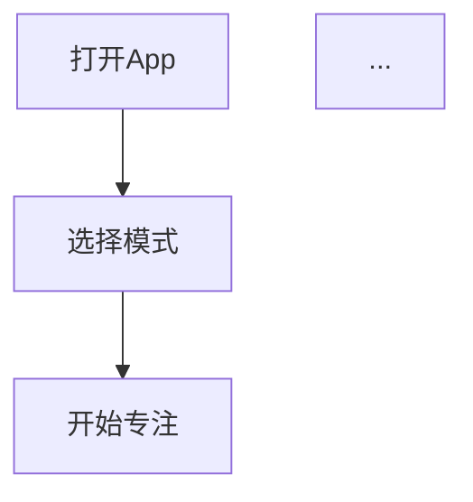

# Skill 创建任务: sop-design

## 任务概述

创建一个 OpenClaw Skill，名为 `sop-design`，用于指导 AI 进行软件项目的设计阶段工作，生成**可执行的需求设计文档（PRD）**。

这个 PRD 不仅是给用户看的，更是后续 AI 写代码和生成测试文档的直接依据。

---

## 目录结构

```
skills/sop-design/
├── SKILL.md                           # 技能主文件
├── prompts/
│   ├── 01-requirement-capture.md      # 需求捕获输入
│   ├── 02-requirement-structuring.md  # 需求结构化解析
│   ├── 03-competitor-analysis.md      # 竞品分析
│   ├── 04-flowchart-validation.md     # 流程图确认
│   ├── 05-feature-generation.md       # 生成主题功能
│   ├── 06-socratic-questioning.md     # 苏格拉底式提问（核心）
│   ├── 07-ui-design.md                # UI设计
│   ├── 08-technical-exploration.md    # 技术方案探索
│   ├── 09-architecture-design.md      # 架构设计
│   ├── 10-testability-design.md       # 可测试性设计（核心）
│   ├── 11-risk-assessment.md          # 风险评估
│   ├── 12-challenge-mode.md           # 挑战模式
│   └── 13-prd-generation.md           # PRD文档生成
└── templates/
    └── prd-template.md                # PRD文档模板
```

---

## 各阶段详细说明

### 阶段1: 需求捕获输入 (01-requirement-capture)

**输入形式**（支持任意一种或组合）：
- 一句话：`"做一个番茄钟App"`
- 粗略想法：一段文字描述
- 参考竞品：`"类似Keep，但专注于力量训练"`
- PRD草稿：已有部分结构的文档

**AI行为**：
1. 识别输入类型
2. 如果是竞品参考，提取竞品名称
3. 如果是PRD草稿，解析已有内容

---

### 阶段2: 需求结构化解析 (02-requirement-structuring)

**AI动作**：
1. **提问澄清**（主动发现模糊点）：
   - "目标用户是谁？"
   - "需要离线使用吗？"
   - "数据存储在本地还是云端？"
   - "有没有预算限制？"

2. **补全隐含需求**
3. **定义边界**（MVP范围 vs 未来扩展）

**输出**：结构化需求摘要表格

```markdown
| 维度 | 内容 |
|------|------|
| 核心目标 | ... |
| 目标用户 | ... |
| 关键功能 | ... |
| 技术约束 | ... |
| 明确不做 | ... |
```

---

### 阶段3: 竞品分析 (03-competitor-analysis)

**AI主动询问**：
> "为了更好地理解你的需求，我可以帮你搜索市场上类似的竞品做参考。需要我进行竞品分析吗？"

**如果用户同意或已提供竞品名**：

1. **搜索竞品**（Web搜索关键词）
2. **展示竞品对比表格**：
   | 竞品名 | 核心功能 | 优点 | 缺点 | 差异化机会 |
3. **用户选择参考竞品**

---

### 阶段4: 流程图确认 (04-flowchart-validation)

**核心要求**：竞品流程图 → **用户确认一致** → 再细化功能

**AI输出**：竞品核心流程图（Mermaid格式）



**AI询问**：
> "这是竞品的核心流程，和你的预期一致吗？有哪些需要调整？"

**必须得到用户明确确认后才能进入下一阶段！**

---

### 阶段5: 生成产品主题功能 (05-feature-generation)

**输出**：核心功能清单（MoSCoW优先级）

```markdown
| 功能ID | 功能名 | 优先级 | 复杂度 | 依赖 |
|--------|--------|--------|--------|------|
| F-001 | 创建番茄钟 | Must | 低 | - |
| F-002 | 白噪音播放 | Should | 中 | F-001 |
```

---

### 阶段6: 苏格拉底式提问 (06-socratic-questioning) ⭐核心

**核心思想**：通过提问帮助用户想清楚，而不是直接给答案。

**AI判断复杂度**：
- **简单功能**：2-3个问题
- **中等功能**：3-5个问题  
- **复杂功能**：5-8个问题

**苏格拉底式提问模板**：

```
🤔 追问1：目的澄清
"你说想要'白噪音功能'，能告诉我用户会在什么场景下使用它吗？"
→ 追问：那如果用户只需要专注，为什么不直接用系统自带的勿扰模式？

🤔 追问2：边界情况
"如果用户设置了30分钟番茄钟，但10分钟后有紧急电话，你认为应该怎么处理？"

🤔 追问3：优先级
"如果开发时间有限，'白噪音'和'统计图表'只能选一个，你会选哪个？为什么？"

🤔 追问4：假设检验
"你假设用户会每天使用这个App，但如果实际上用户一周只用一次，这个功能设计还合理吗？"

🤔 追问5：反面思考
"如果我们不做这个功能，最坏会发生什么？"
```

**每个功能点都要追问，直到用户说"这个我已经想清楚了"**

**记录暴露出的隐性需求和边界条件**

---

### 阶段7: UI设计 (07-ui-design)

**AI主动询问**：
> "功能逻辑已经比较清晰了。接下来关于UI设计，你有偏好吗？
> - 选项A：文字描述布局
> - 选项B：详细组件属性表格
> - 选项C：AI生成可视化Mockup图
> - 或者跳过UI细节？"

**如果选择B（表格化）- 强制输出**：
```markdown
| 页面 | 组件名 | 类型 | 属性 | 状态 |
|------|--------|------|------|------|
| 首页 | startBtn | Button | color=#6200EE | default/pressed |
```

---

### 阶段8: 技术方案探索 (08-technical-exploration)

**AI动作**：
1. 基于需求，生成 **2-3个技术方案**
2. 每个方案包含：
   - 技术栈明细（含具体版本号）
   - 架构图（Mermaid）
   - 优缺点分析
   - 适用场景
   - 风险点

**用户决策**：选择其中一个方案

---

### 阶段9: 架构设计 (09-architecture-design)

**基于用户选定的方案，生成**：
- Mermaid 状态机图
- 数据流转图
- 时序图（如有必要）

---

### 阶段10: 可测试性设计 (10-testability-design) ⭐核心

**这是最关键的部分，确保PRD可被后续AI用于代码和测试生成**

**每个功能必须包含**：

```markdown
### 功能: [功能名]

#### 功能描述
[清晰描述这个功能做什么]

#### 输入
| 字段 | 类型 | 必填 | 约束条件 |
|------|------|------|----------|
| name | String | 是 | 长度2-20字符 |

#### 输出
| 字段 | 类型 | 说明 |
|------|------|------|
| result | Boolean | 操作是否成功 |

#### 边界条件
- 边界1: [具体描述]
- 边界2: [具体描述]

#### 验收标准 (AC)
- [ ] AC1: [Given-When-Then格式]
- [ ] AC2: [Given-When-Then格式]

#### 测试要点
- Happy Path: [描述]
- 异常场景: [描述]
- 边界测试: [描述]
```

**Given-When-Then示例**：
```
AC1: 用户成功创建番茄钟
Given: 用户已输入任务名称"学习英语"
When: 用户点击"开始"按钮
Then: 
  - 计时器开始30分钟倒计时
  - 显示"学习中"状态
  - 记录开始时间到本地存储
```

---

### 阶段11: 风险评估 (11-risk-assessment)

生成风险矩阵：
| 风险 | 影响 | 概率 | 缓解措施 |

---

### 阶段12: 挑战模式 (12-challenge-mode)

**AI自我挑战**（至少3个）：
```
🔍 挑战1: 边界场景
"如果用户在使用中强行杀进程，数据会不会丢失？"
→ 结论: 需要实现自动保存草稿机制

🔍 挑战2: 异常流
"如果AI服务返回格式错误，应用会不会崩溃？"
→ 结论: 需要添加数据格式校验和降级策略

🔍 挑战3: 用户体验
"如果用户一天使用10次，现在的日志策略会不会撑爆存储？"
→ 结论: 需要实现日志轮转和自动清理
```

---

### 阶段13: PRD文档生成 (13-prd-generation)

**按模板组装完整文档**

---

## PRD文档模板 (templates/prd-template.md)

见下方详细模板内容。

---

## SKILL.md 结构

SKILL.md 需要包含：
1. 技能元数据（名称、描述、emoji）
2. 使用场景
3. 使用方法
4. 各阶段详细说明
5. 示例
6. 注意事项

---

## 关键原则

1. **文档可执行性**：PRD不仅是给用户看的，更是AI写代码和测试的直接依据
2. **边界清晰**：每个功能的输入、输出、边界条件必须明确
3. **苏格拉底式提问**：通过提问帮助用户想清楚，而不是直接给答案
4. **流程确认**：竞品流程图必须得到用户确认后才能继续
5. **可测试性**：每个功能必须有Given-When-Then验收标准

---

## 输出要求

1. 创建 `skills/sop-design/` 目录结构
2. 每个prompt文件包含：阶段目标、AI角色、输出格式、示例
3. PRD模板必须完整、可直接使用
4. SKILL.md必须详细、易读
5. 所有文件使用UTF-8编码，避免中文乱码

请严格按照以上要求创建所有文件。
