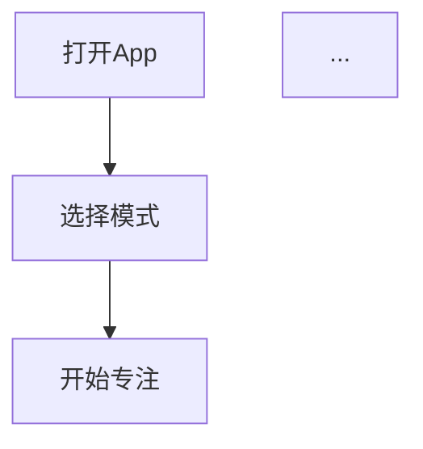
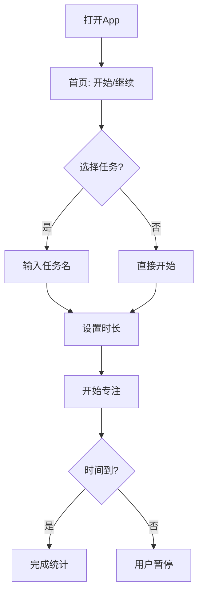

# sop-design - 软件设计阶段引导技能

**🎨 将模糊想法转化为可执行的PRD**

## 技能元数据

| 属性 | 内容 |
|------|------|
| **名称** | sop-design |
| **版本** | 1.0.0 |
| **作者** | OpenClaw Skill Hub |
| **分类** | 项目管理 / 软件设计 |
| **触发词** | `设计SOP`、`生成PRD`、`软件设计`、`需求分析` |
| **Emoji** | 🎨 |

## 简介

`sop-design` 是一个引导式软件设计技能，帮助用户将模糊的产品想法转化为**结构化、可执行、可测试**的PRD（产品需求文档）。

这个PRD不仅是给用户看的，更是后续AI写代码和生成测试文档的直接依据。

## 使用场景

- 🚀 **创业想法验证** - 把"做一个XX App"变成完整的技术方案
- 📝 **外包项目对接** - 生成清晰的需求文档，减少沟通成本
- 🔧 **技术选型决策** - 对比多个技术方案，选择最适合的
- ✅ **测试驱动开发** - 生成Given-When-Then验收标准
- 📚 **团队知识沉淀** - 标准化的PRD模板

## 使用方法

### 快速开始

```
用户: "设计一个番茄钟App"
```

AI会自动进入 **sop-design** 流程，依次完成：
1. 需求捕获 → 2. 结构化解析 → 3. 竞品分析 → 4. 流程确认 → 5. 功能生成 → 6. 苏格拉底提问 → 7. UI设计 → 8. 技术探索 → 9. 架构设计 → 10. 可测试性设计 → 11. 风险评估 → 12. 挑战模式 → 13. PRD生成

### 高级用法

```
用户: "我要设计一个健身追踪App，类似Keep但专注于力量训练"
```

AI会：
1. 识别竞品参考（Keep）
2. 提取差异化需求（专注力量训练）
3. 自动进行竞品分析
4. 生成针对性的PRD

## 13阶段设计流程

### 阶段1: 需求捕获 (01-requirement-capture)
**目标**: 识别用户输入类型，提取初步需求

**支持输入形式**:
- 💬 一句话: "做一个番茄钟App"
- 📝 粗略想法: 一段文字描述
- 🔍 参考竞品: "类似Keep，但专注于力量训练"
- 📄 PRD草稿: 已有部分结构的文档

**AI行为**:
1. 识别输入类型
2. 如果是竞品参考，提取竞品名称
3. 如果是PRD草稿，解析已有内容

**输出**: 初步需求摘要

---

### 阶段2: 需求结构化 (02-requirement-structuring)
**目标**: 澄清模糊点，补全隐含需求，定义边界

**AI动作**:
1. **主动提问澄清**:
   - "目标用户是谁？"
   - "需要离线使用吗？"
   - "数据存储在本地还是云端？"
   - "有没有预算限制？"

2. **补全隐含需求**

3. **定义边界**（MVP范围 vs 未来扩展）

**输出**: 结构化需求摘要表格

```markdown
| 维度 | 内容 |
|------|------|
| 核心目标 | ... |
| 目标用户 | ... |
| 关键功能 | ... |
| 技术约束 | ... |
| 明确不做 | ... |
```

---

### 阶段3: 竞品分析 (03-competitor-analysis)
**目标**: 理解市场现状，找到差异化机会

**AI主动询问**:
> "为了更好地理解你的需求，我可以帮你搜索市场上类似的竞品做参考。需要我进行竞品分析吗？"

**如果用户同意或已提供竞品名**:

1. **搜索竞品**（Web搜索关键词）
2. **展示竞品对比表格**:
   | 竞品名 | 核心功能 | 优点 | 缺点 | 差异化机会 |
3. **用户选择参考竞品**

---

### 阶段4: 流程图确认 (04-flowchart-validation) ⭐关键节点
**目标**: 确保理解正确后再细化

**核心要求**: 竞品流程图 → **用户确认一致** → 再细化功能

**AI输出**: 竞品核心流程图（Mermaid格式）



**AI询问**:
> "这是竞品的核心流程，和你的预期一致吗？有哪些需要调整？"

⚠️ **必须得到用户明确确认后才能进入下一阶段！**

---

### 阶段5: 功能生成 (05-feature-generation)
**目标**: 生成完整的功能清单

**输出**: 核心功能清单（MoSCoW优先级）

```markdown
| 功能ID | 功能名 | 优先级 | 复杂度 | 依赖 |
|--------|--------|--------|--------|------|
| F-001 | 创建番茄钟 | Must | 低 | - |
| F-002 | 白噪音播放 | Should | 中 | F-001 |
```

---

### 阶段6: 苏格拉底提问 (06-socratic-questioning) ⭐核心
**目标**: 通过提问帮助用户想清楚，暴露隐性需求

**AI判断复杂度**:
- **简单功能**: 2-3个问题
- **中等功能**: 3-5个问题
- **复杂功能**: 5-8个问题

**苏格拉底式提问模板**:

```
🤔 追问1：目的澄清
"你说想要'白噪音功能'，能告诉我用户会在什么场景下使用它吗？"
→ 追问：那如果用户只需要专注，为什么不直接用系统自带的勿扰模式？

🤔 追问2：边界情况
"如果用户设置了30分钟番茄钟，但10分钟后有紧急电话，你认为应该怎么处理？"

🤔 追问3：优先级
"如果开发时间有限，'白噪音'和'统计图表'只能选一个，你会选哪个？为什么？"

🤔 追问4：假设检验
"你假设用户会每天使用这个App，但如果实际上用户一周只用一次，这个功能设计还合理吗？"

🤔 追问5：反面思考
"如果我们不做这个功能，最坏会发生什么？"
```

**每个功能点都要追问，直到用户说"这个我已经想清楚了"**

**记录暴露出的隐性需求和边界条件**

---

### 阶段7: UI设计 (07-ui-design)
**目标**: 明确界面层级和交互细节

**AI主动询问**:
> "功能逻辑已经比较清晰了。接下来关于UI设计，你有偏好吗？
> - 选项A：文字描述布局
> - 选项B：详细组件属性表格
> - 选项C：AI生成可视化Mockup图
> - 或者跳过UI细节？"

**如果选择B（表格化）- 强制输出**:
```markdown
| 页面 | 组件名 | 类型 | 属性 | 状态 |
|------|--------|------|------|------|
| 首页 | startBtn | Button | color=#6200EE | default/pressed |
```

---

### 阶段8: 技术方案探索 (08-technical-exploration)
**目标**: 提供多个可选技术方案，帮助决策

**AI动作**:
1. 基于需求，生成 **2-3个技术方案**
2. 每个方案包含：
   - 技术栈明细（含具体版本号）
   - 架构图（Mermaid）
   - 优缺点分析
   - 适用场景
   - 风险点

**用户决策**: 选择其中一个方案

---

### 阶段9: 架构设计 (09-architecture-design)
**目标**: 基于选定方案，生成详细架构图

**基于用户选定的方案，生成**:
- Mermaid 状态机图
- 数据流转图
- 时序图（如有必要）

---

### 阶段10: 可测试性设计 (10-testability-design) ⭐核心
**目标**: 生成详细的测试规范和验收标准

**这是最关键的部分，确保PRD可被后续AI用于代码和测试生成**

**每个功能必须包含**:

```markdown
### 功能: [功能名]

#### 功能描述
[清晰描述这个功能做什么]

#### 输入
| 字段 | 类型 | 必填 | 约束条件 |
|------|------|------|----------|
| name | String | 是 | 长度2-20字符 |

#### 输出
| 字段 | 类型 | 说明 |
|------|------|------|
| result | Boolean | 操作是否成功 |

#### 边界条件
- 边界1: [具体描述]
- 边界2: [具体描述]

#### 验收标准 (AC)
- [ ] AC1: [Given-When-Then格式]
- [ ] AC2: [Given-When-Then格式]

#### 测试要点
- Happy Path: [描述]
- 异常场景: [描述]
- 边界测试: [描述]
```

**Given-When-Then示例**:
```
AC1: 用户成功创建番茄钟
Given: 用户已输入任务名称"学习英语"
When: 用户点击"开始"按钮
Then: 
  - 计时器开始30分钟倒计时
  - 显示"学习中"状态
  - 记录开始时间到本地存储
```

---

### 阶段11: 风险评估 (11-risk-assessment)
**目标**: 识别潜在风险，制定缓解措施

生成风险矩阵:
| 风险 | 影响 | 概率 | 缓解措施 |

---

### 阶段12: 挑战模式 (12-challenge-mode)
**目标**: AI自我挑战，发现遗漏的问题

**AI自我挑战**（至少3个）:
```
🔍 挑战1: 边界场景
"如果用户在使用中强行杀进程，数据会不会丢失？"
→ 结论: 需要实现自动保存草稿机制

🔍 挑战2: 异常流
"如果AI服务返回格式错误，应用会不会崩溃？"
→ 结论: 需要添加数据格式校验和降级策略

🔍 挑战3: 用户体验
"如果用户一天使用10次，现在的日志策略会不会撑爆存储？"
→ 结论: 需要实现日志轮转和自动清理
```

---

### 阶段13: PRD文档生成 (13-prd-generation)
**目标**: 按模板组装完整PRD文档

使用 `templates/prd-template.md` 模板，整合所有阶段输出，生成最终PRD。

---

## 示例完整流程

### 输入
```
用户: "我想做一个番茄钟App，帮助我专注学习"
```

### 阶段1-2: 需求捕获与结构化
```
AI: 为了更好地设计这个产品，我先问你几个问题：
1. 这个App的目标用户是谁？只有你自己用，还是希望分享给其他人？
2. 需要离线使用吗？还是必须有网络？
3. 你想记录统计数据吗？比如每天专注了多久？
4. 有没有预算限制？比如服务器成本？
```

### 阶段3: 竞品分析
```
AI: 市场上有很多番茄钟App，比如Forest、番茄Todo、滴答清单。要我帮你分析一下吗？
```

### 阶段4: 流程图确认
```
AI: 根据你的需求，我画了一个核心流程图：



这个流程符合你的预期吗？需要调整哪里？
```

### 阶段5-6: 功能生成与苏格拉底提问
```
AI: 基于前面的讨论，我整理出以下核心功能：
| 功能ID | 功能名 | 优先级 |
|--------|--------|--------|
| F-001 | 创建番茄钟 | Must |
| F-002 | 白噪音播放 | Should |

现在让我对每个功能进行苏格拉底式提问：

🤔 关于"白噪音功能"：
"你说想要白噪音，能告诉我你会在什么场景下使用它吗？"
"如果开发时间有限，白噪音和统计图表只能选一个，你会选哪个？"
```

### 阶段13: PRD生成
```
AI: 所有信息已收集完毕！我正在生成完整PRD文档...

✅ PRD生成完成！文档包含：
- 项目概述
- 功能规格（含输入/输出/边界/验收标准）
- 技术方案
- UI设计
- 测试计划

需要我导出为Markdown文件吗？
```

---

## 注意事项

### ⚠️ 关键原则

1. **文档可执行性**: PRD不仅是给用户看的，更是AI写代码和测试的直接依据
2. **边界清晰**: 每个功能的输入、输出、边界条件必须明确
3. **苏格拉底式提问**: 通过提问帮助用户想清楚，而不是直接给答案
4. **流程确认**: 竞品流程图必须得到用户确认后才能继续
5. **可测试性**: 每个功能必须有Given-When-Then验收标准

### 🚫 禁忌

- ❌ 不要直接跳到PRD生成，必须走完所有阶段
- ❌ 不要替用户做决定，每个关键决策需要用户确认
- ❌ 不要忽略边界情况
- ❌ 不要跳过可测试性设计

### ✅ 最佳实践

- ✅ 保持对话友好但专业
- ✅ 用表格和图表帮助理解
- ✅ 主动提问，发现隐性需求
- ✅ 记录每个决策点和理由
- ✅ 让用户感觉被引导而非被审问

---

## 文件结构

```
skills/sop-design/
├── SKILL.md                           # 本文件
├── prompts/
│   ├── 01-requirement-capture.md      # 需求捕获
│   ├── 02-requirement-structuring.md  # 需求结构化
│   ├── 03-competitor-analysis.md      # 竞品分析
│   ├── 04-flowchart-validation.md     # 流程图确认
│   ├── 05-feature-generation.md       # 功能生成
│   ├── 06-socratic-questioning.md     # 苏格拉底提问
│   ├── 07-ui-design.md                # UI设计
│   ├── 08-technical-exploration.md    # 技术方案
│   ├── 09-architecture-design.md      # 架构设计
│   ├── 10-testability-design.md       # 可测试性设计
│   ├── 11-risk-assessment.md          # 风险评估
│   ├── 12-challenge-mode.md           # 挑战模式
│   └── 13-prd-generation.md           # PRD生成
└── templates/
    └── prd-template.md                # PRD模板
```

---

## 版本历史

| 版本 | 日期 | 变更 |
|------|------|------|
| 1.0.0 | 2025-03-17 | 初始版本 |

---

*Made with 🎨 by OpenClaw Skill Hub*
