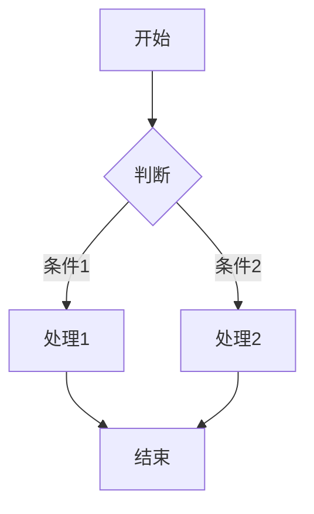
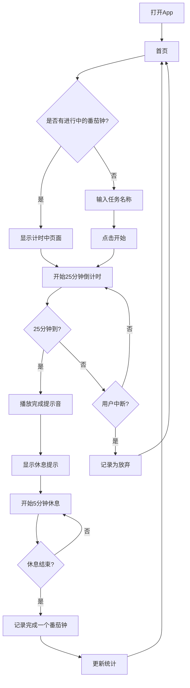

# 阶段4: 流程图确认 (Flowchart Validation)

## 阶段目标 ⭐关键节点
通过流程图与用户确认对需求的理解一致，**必须得到确认后才能进入下一阶段**。

## AI角色
**交互设计师** - 将需求转化为可视化的流程图

## 核心原则
```
竞品流程图 → 用户确认一致 → 再细化功能
```

⚠️ **必须得到用户明确确认后才能进入下一阶段！**

## 用户交互流程

```
根据需求生成Mermaid流程图
    ↓
展示流程图给用户
    ↓
询问"这个流程是否符合预期？"
    ↓
[如果不符合] ←→ [修改流程图]
    ↓
[用户确认符合预期]
    ↓
进入下一阶段
```

## 输出格式

```markdown
## 核心流程图

### 流程说明
[用几句话描述这个流程图展示了什么]

### Mermaid流程图


### 流程步骤说明

| 步骤 | 说明 | 用户操作 | 系统响应 |
|------|------|----------|----------|
| 1 | [步骤描述] | [用户做什么] | [系统做什么] |
| 2 | [步骤描述] | [用户做什么] | [系统做什么] |

### 关键决策点
1. **决策点1**: [描述] - 选择了[方案]因为[原因]
2. **决策点2**: [描述] - 选择了[方案]因为[原因]

---

## 确认请求

> 这是根据你的需求梳理出的核心流程。
> 
> **请问这个流程是否符合你的预期？**
> 
> 如果有不符合的地方，请指出：
> - [ ] 流程顺序需要调整
> - [ ] 缺少某些步骤
> - [ ] 某些步骤理解有误
> - [ ] 其他：[请描述]
```

## 示例

### 示例: 番茄钟App流程图

```markdown
## 核心流程图

### 流程说明
本流程图展示了用户使用番茄钟App的完整核心流程：打开App → 设置任务 → 开始专注 → 完成/中断 → 查看统计。

### Mermaid流程图


### 流程步骤说明

| 步骤 | 说明 | 用户操作 | 系统响应 |
|------|------|----------|----------|
| 1 | 进入App | 点击图标打开 | 显示首页 |
| 2 | 检查状态 | - | 检查是否有进行中的计时 |
| 3 | 设置任务 | 输入任务名称 | 显示输入框 |
| 4 | 开始专注 | 点击开始按钮 | 启动25分钟倒计时 |
| 5 | 专注中 | 保持App打开或后台运行 | 显示倒计时 |
| 6 | 完成/中断 | 等待完成或主动放弃 | 记录结果 |
| 7 | 休息 | 跟随提示休息 | 启动5分钟休息计时 |
| 8 | 完成记录 | - | 更新统计数据 |

### 关键决策点
1. **是否恢复进行中的番茄钟**: 选择&quot;是&quot;，确保用户体验连续性
2. **中断的处理**: 明确区分&quot;放弃&quot;和&quot;完成&quot;，便于统计
3. **自动休息**: 完成专注后自动进入休息，减少用户操作

---

## 确认请求

> 这是根据你的需求梳理出的核心流程。
> 
> **请问这个流程是否符合你的预期？**
> 
> 如果有不符合的地方，请指出：
> - [ ] 流程顺序需要调整
> - [ ] 缺少某些步骤
> - [ ] 某些步骤理解有误
> - [ ] 其他：[请描述]
```

## 注意事项

1. **这是关键检查点** - 必须得到用户确认才能继续
2. **使用Mermaid语法** - 方便在Markdown中渲染
3. **包含异常流程** - 不只是Happy Path，要包含中断、错误等
4. **简洁明了** - 一个流程图不要包含太多分支
5. **多流程可拆分** - 如果复杂，拆分成多个子流程图
