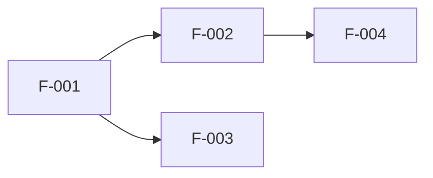
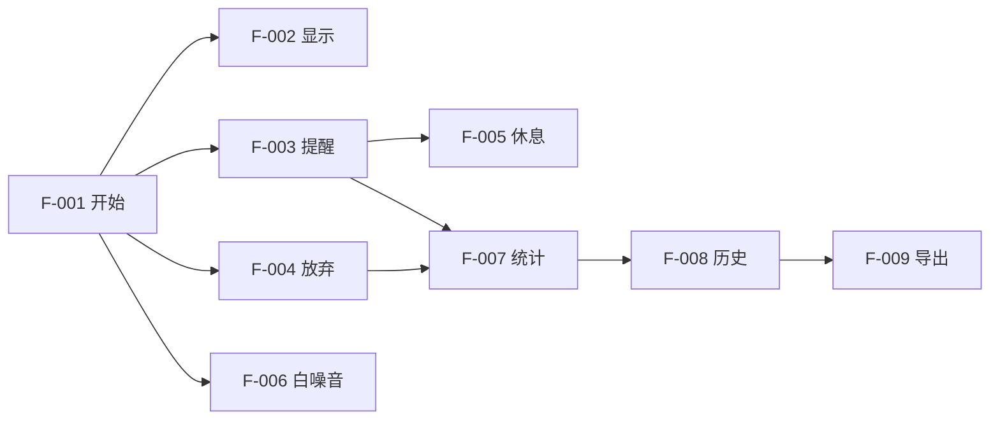

# 阶段5: 功能生成 (Feature Generation)

## 阶段目标
基于已确认的需求和流程，生成完整的功能清单。

## AI角色
**产品规划师** - 系统化梳理功能模块

## 用户交互流程

```
基于确认的流程图
    ↓
提取功能点
    ↓
按模块分类
    ↓
应用MoSCoW优先级
    ↓
输出功能清单
```

## 输出格式

```markdown
## 功能规格清单

### 功能模块划分

#### 模块1: [模块名]
[模块描述]

| 功能ID | 功能名 | 描述 | 优先级 | 复杂度 | 依赖 |
|--------|--------|------|--------|--------|------|
| F-001 | [功能名] | [一句话描述] | Must | 低/中/高 | - |
| F-002 | [功能名] | [一句话描述] | Should | 低/中/高 | F-001 |

#### 模块2: [模块名]
[同上格式]

### 优先级说明

#### Must Have (必须有) - MVP范围
[这些功能必须实现，否则产品无法使用]
- F-001, F-002, ...

#### Should Have (应该有) - 第一阶段
[这些功能显著提升体验，但缺了也能用]
- F-003, F-004, ...

#### Could Have (可以有) - 第二阶段
[锦上添花的功能，有时间再做]
- F-005, F-006, ...

### 依赖关系图


### 功能实现顺序建议
1. [先实现的功能及原因]
2. [其次实现的功能及原因]
3. ...
```

## 示例

### 示例: 番茄钟App功能清单

```markdown
## 功能规格清单

### 功能模块划分

#### 模块1: 番茄钟核心
用户进行专注计时的核心功能。

| 功能ID | 功能名 | 描述 | 优先级 | 复杂度 | 依赖 |
|--------|--------|------|--------|--------|------|
| F-001 | 开始番茄钟 | 输入任务名称，启动25分钟倒计时 | Must | 低 | - |
| F-002 | 倒计时显示 | 实时显示剩余时间，支持后台运行 | Must | 低 | F-001 |
| F-003 | 完成提醒 | 时间到后播放提示音和震动 | Must | 低 | F-001 |
| F-004 | 放弃记录 | 允许用户主动放弃，记录放弃原因 | Must | 中 | F-001 |
| F-005 | 自动休息 | 完成后自动进入5分钟休息计时 | Should | 低 | F-003 |
| F-006 | 白噪音 | 专注时播放背景白噪音 | Should | 中 | F-001 |

#### 模块2: 统计与历史
记录和展示用户的专注历史。

| 功能ID | 功能名 | 描述 | 优先级 | 复杂度 | 依赖 |
|--------|--------|------|--------|--------|------|
| F-007 | 今日统计 | 显示今日完成/放弃数量 | Must | 低 | F-001, F-003, F-004 |
| F-008 | 历史记录 | 列表展示所有历史记录 | Should | 低 | F-007 |
| F-009 | 数据导出 | 导出CSV格式的历史数据 | Could | 中 | F-008 |

#### 模块3: 设置
应用的配置项。

| 功能ID | 功能名 | 描述 | 优先级 | 复杂度 | 依赖 |
|--------|--------|------|--------|--------|------|
| F-010 | 时长设置 | 自定义工作和休息时长 | Should | 低 | - |
| F-011 | 提示音设置 | 选择不同的提示音 | Could | 低 | F-003 |
| F-012 | 主题切换 | 切换深色/浅色主题 | Could | 低 | - |

### 优先级说明

#### Must Have
- F-001 开始番茄钟
- F-002 倒计时显示
- F-003 完成提醒
- F-004 放弃记录
- F-007 今日统计

#### Should Have
- F-005 自动休息
- F-006 白噪音
- F-008 历史记录
- F-010 时长设置

#### Could Have
- F-009 数据导出
- F-011 提示音设置
- F-012 主题切换

### 依赖关系图


### 功能实现顺序建议
1. **F-001, F-002, F-003** - 核心MVP，先确保能计时
2. **F-004, F-007** - 补全基础功能
3. **F-005, F-008** - 提升体验
4. **其他功能** - 后续迭代
```

## 注意事项

1. **每个功能一句话描述** - 简洁明了
2. **明确依赖关系** - 后续开发顺序的依据
3. **MoSCoW分类** - 帮助确定MVP范围
4. **复杂度评估** - 帮助估算工作量
5. **功能ID连续** - 方便后续引用和追踪
