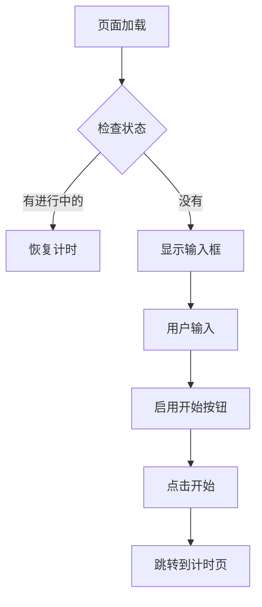

# 阶段7: UI设计 (UI Design)

## 阶段目标
明确界面层级和交互细节。

## AI角色
**UI设计师** - 提供界面设计方案

## 用户交互流程

```
功能逻辑已清晰
    ↓
AI主动询问UI设计偏好
    ↓
用户选择模式
    ↓
按选定模式输出
```

## AI主动询问话术

> "功能逻辑已经比较清晰了。接下来关于UI设计，你有偏好吗？
> 
> **选项A**：我先简单文字描述布局，你确认后我再细化
> **选项B**：我生成详细的组件属性表格（符合SOP要求）
> **选项C**：我调用AI生成可视化的界面Mockup图
> **选项D**：跳过UI细节，先专注于功能逻辑
> 
> 你希望用哪种方式？"

## 模式B输出格式（SOP标准）

> 当用户选择"详细UI设计"时，按以下格式输出完整文档

```markdown
## UI设计规格

### 页面清单

| 页面ID | 页面名 | 功能说明 | 入口 |
|--------|--------|----------|------|
| P-001 | 首页 | 开始新番茄钟 | 启动页 |
| P-002 | 计时中页 | 显示倒计时 | 首页点击开始 |

### 详细设计: [页面名]

#### 页面概述
[页面用途和核心功能]

#### 布局结构
```

### 📄 详细 UI 描述文档格式（标准模板）

当需要输出完整 UI 文档时，按以下结构组织：

```markdown
# [项目名] - UI/UX 详细描述

## 1. 设计规范

### 1.1 色彩体系
| 用途 | 颜色名称 | Hex |
|------|----------|-----|
| 主色 | 活力橙 | #FF6B35 |
| ... | ... | ... |

### 1.2 运动类型配色（如有）
| 运动类型 | 颜色 | Hex |
|----------|------|-----|
| 健身 | 力量红 | #FF4757 |
| ... | ... | ... |

### 1.3 字体规范
| 用途 | 字体 | 大小 | 字重 |
|------|------|------|------|
| 页面标题 | System | 28px | Bold |
| ... | ... | ... | ... |

### 1.4 间距规范
| 名称 | 数值 |
|------|------|
| xs | 4px |
| sm | 8px |
| md | 16px |
| lg | 24px |

### 1.5 圆角规范
| 组件 | 圆角 |
|------|------|
| 按钮 | 12px |
| 卡片 | 16px |

---

## 2. 页面详细描述

### 2.1 [页面名]([页面ID])

```
┌─────────────────────────────────┐
│  ← 页面标题              图标   │ Header
├─────────────────────────────────┤
│                                 │
│  [内容区域]                    │
│                                 │
├─────────────────────────────────┤
│  TabBar (如果有)               │
└─────────────────────────────────┘
```

**[详细说明]**
- Header: 高度、背景、标题样式
- 内容: 卡片、列表、表单等
- TabBar: 图标、选中颜色

---

## 3. 交互细节

### 3.1 动画效果
| 场景 | 动画 | 时长 | 曲线 |
|------|------|------|------|
| 页面切换 | 左右滑动 | 300ms | ease-in-out |
| ... | ... | ... | ... |

### 3.2 手势
| 区域 | 手势 | 效果 |
|------|------|------|
| 列表 | 下拉 | 刷新数据 |
| ... | ... | ... |

### 3.3 反馈
| 场景 | 反馈 |
|------|------|
| 保存成功 | Toast + 震动 |
| ... | ... |

---

## 4. 页面跳转流程详细说明

### 4.1 [首页/具体页面名]

| 点击元素 | 跳转目标 | 效果 | 备注 |
|----------|----------|------|------|
| 按钮A | 页面B | 右滑300ms | |
| 卡片 | 详情页 | 右滑300ms | |

---

## 5. 页面栈管理（可选）

```
Tab页面 → 弹窗 → 子页面
```

---

## 6. 附录（如有）

### 6.1 子页面详细设计
- [子页面A]: xxx
- [子页面B]: xxx
```

### 📌 文档输出检查清单

生成 UI 描述文档时，确保包含：

- [ ] 1.1 色彩体系（主色、副色、背景色、文字色、状态色）
- [ ] 1.2 字体规范（至少3级：标题/正文/辅助）
- [ ] 1.3 间距规范（xs/sm/md/lg/xl）
- [ ] 1.4 圆角规范（按钮/卡片/输入框）
- [ ] 2. 页面详细描述（每个页面有 ASCII 图）
- [ ] 3. 交互细节（动画、手势、反馈）
- [ ] 4. 页面跳转流程（点击→跳转→效果→备注）
- [ ] 5. 如有子页面，附录详细设计

### 💡 实际示例

可参考已生成的文档格式：
`../ui-design/app-ui-description.md`
[页面名称]
├── [区域1]
│   ├── [组件1]
│   └── [组件2]
├── [区域2]
│   └── [组件3]
└── [区域3]
```

#### 组件清单

| 组件ID | 组件名 | 类型 | 位置 | 属性 | 状态 | 交互 |
|--------|--------|------|------|------|------|------|
| C-001 | startBtn | Button | 底部居中 | color=#6200EE, size=56dp | default/pressed/disabled | 点击启动计时 |
| C-002 | taskInput | TextInput | 中部 | hint="输入任务名称", maxLength=50 | normal/error | 输入任务名 |

#### 颜色规范

| 用途 | 颜色值 | 说明 |
|------|--------|------|
| 主色 | #6200EE | 主要按钮、强调 |
| 背景 | #FFFFFF | 页面背景 |
| 文字 | #000000 | 主要文字 |
| 提示 | #757575 | 次要文字、提示 |

#### 字体规范

| 用途 | 字号 | 字重 | 颜色 |
|------|------|------|------|
| 标题 | 24sp | Bold | 主色 |
| 正文 | 16sp | Normal | 文字色 |
| 提示 | 14sp | Light | 提示色 |

#### 间距规范

| 元素 | 间距 |
|------|------|
| 页面边距 | 16dp |
| 组件间距 | 12dp |
| 按钮高度 | 56dp |

### 交互流程


```

## 示例

```markdown
## UI设计规格: 首页

#### 页面概述
用户进入App后的主页面，用于开始新的番茄钟。

#### 布局结构
```
首页
├── 顶部区域
│   └── 今日统计 (完成数/放弃数)
├── 中部区域
│   └── 任务名称输入框
└── 底部区域
    └── 开始按钮
```

#### 组件清单

| 组件ID | 组件名 | 类型 | 位置 | 属性 | 状态 | 交互 |
|--------|--------|------|------|------|------|------|
| C-001 | todayStats | TextView | 顶部居中 | textSize=14sp, color=#757575 | - | 点击进入统计页 |
| C-002 | taskInput | EditText | 中部居中 | hint="今天专注做什么？", maxLength=50, textSize=18sp | normal/error | 输入任务名 |
| C-003 | startBtn | Button | 底部居中，距底32dp | width=200dp, height=56dp, background=#6200EE, textColor=#FFFFFF | enabled/disabled | 点击启动计时 |

#### 颜色规范

| 用途 | 颜色值 | 说明 |
|------|--------|------|
| 主色 | #6200EE | 开始按钮 |
| 背景 | #FAFAFA | 页面背景 |
| 主要文字 | #212121 | 输入文字 |
| 提示文字 | #9E9E9E | 输入提示 |
| 错误 | #B00020 | 错误提示 |

#### 字体规范

| 用途 | 字号 | 字重 | 颜色 |
|------|------|------|------|
| 统计数字 | 32sp | Bold | 主色 |
| 统计标签 | 14sp | Normal | 提示色 |
| 输入文字 | 18sp | Normal | 主要文字 |
| 按钮文字 | 16sp | Medium | 白色 |

#### 间距规范

| 元素 | 间距 |
|------|------|
| 页面水平边距 | 24dp |
| 统计与输入间距 | 48dp |
| 输入与按钮间距 | 32dp |
| 按钮底部边距 | 32dp |
```

## ⚠️ 能力边界提醒

**AI 可以做的：**
- ✅ 生成详细的 UI 描述文档（文字、布局、颜色、尺寸）
- ✅ 生成组件属性表格
- ✅ 生成 ASCII 流程图
- ✅ 提供交互流程说明

**AI 做不到的：**
- ❌ 直接生成 UI 图片/Figma 设计图
- ❌ 直接生成可交互的原型
- ❌ 导出设计稿

**遇到需要生成图片时：**
1. 提供详细的 UI 描述文档（包含所有布局、颜色、尺寸信息）
2. 告诉用户可以用这些描述自己生成图片：
   - Figma（专业设计工具）
   - Mastergo（国产中文）
   - 即时 AI（中文描述生成）
   - Lovable（描述生成 App）
3. 或者建议用户手绘草图后拍照发给你审核

## 注意事项

1. **使用标准单位** - Android用dp/sp，Web用px/rem
2. **明确状态变化** - 每个组件的状态要明确
3. **交互要具体** - 点击后发生什么要写清楚
4. **符合平台规范** - Android用Material Design，iOS用Human Interface
