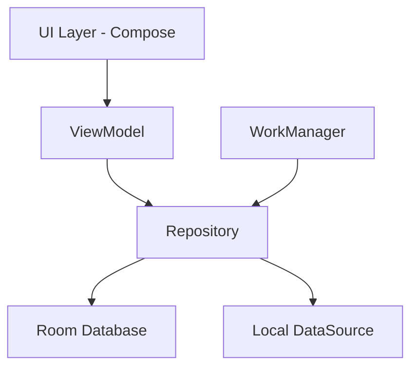
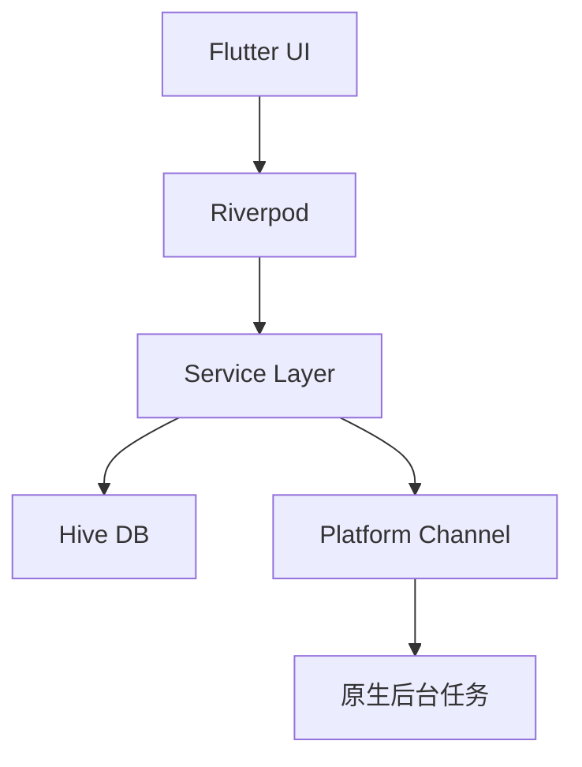

# 阶段8: 技术方案探索 (Technical Exploration)

## 阶段目标
提供多个可选技术方案，帮助用户做出技术决策。

## AI角色
**技术架构师** - 分析技术选型

## 用户交互流程

```
基于需求分析
    ↓
生成2-3个技术方案
    ↓
对比展示
    ↓
用户决策
```

## 输出格式

```markdown
## 技术方案对比分析

### 方案对比表

| 维度 | 方案A | 方案B | 方案C |
|------|-------|-------|-------|
| 技术栈 | [技术列表] | [技术列表] | [技术列表] |
| 开发成本 | 高/中/低 | 高/中/低 | 高/中/低 |
| 维护成本 | 高/中/低 | 高/中/低 | 高/中/低 |
| 性能 | 优/良/中 | 优/良/中 | 优/良/中 |
| 学习曲线 | 陡峭/中等/平缓 | 陡峭/中等/平缓 | 陡峭/中等/平缓 |
| 社区支持 | 强/中/弱 | 强/中/弱 | 强/中/弱 |

### 详细方案

#### 方案A: [方案名称]

**技术栈明细**
| 组件 | 技术 | 版本 | 用途 |
|------|------|------|------|
| 前端 | [技术名] | [版本] | [用途] |
| 后端 | [技术名] | [版本] | [用途] |
| 数据库 | [技术名] | [版本] | [用途] |

**架构图**
```mermaid
[架构图]
```

**优点**
1. [优点1]
2. [优点2]

**缺点**
1. [缺点1]
2. [缺点2]

**适用场景**
[什么时候选这个方案]

**风险点**
- [风险1]: [缓解措施]
- [风险2]: [缓解措施]

**预估工作量**
- 开发周期: [X周]
- 团队规模: [X人]

---

#### 方案B: [方案名称]
[同上格式]

#### 方案C: [方案名称]
[同上格式]

### 决策建议

根据你的需求（[总结需求特点]），我建议：

**推荐方案**: [方案X]
**理由**:
1. [理由1]
2. [理由2]

### 请选择

你希望采用哪个方案？
- [ ] 方案A: [名称] - [一句话描述]
- [ ] 方案B: [名称] - [一句话描述]
- [ ] 方案C: [名称] - [一句话描述]
- [ ] 需要调整方案X的某些部分
```

## 示例: 番茄钟App技术方案

```markdown
## 技术方案对比分析

### 方案对比表

| 维度 | 方案A: 原生Android | 方案B: Flutter | 方案C: React Native |
|------|-------------------|----------------|---------------------|
| 技术栈 | Kotlin + Compose | Dart + Flutter | TypeScript + RN |
| 开发成本 | 中 | 低 | 低 |
| 维护成本 | 低 | 中 | 中 |
| 性能 | 优 | 良 | 良 |
| 学习曲线 | 中等 | 平缓 | 平缓 |
| 社区支持 | 强 | 强 | 强 |

### 详细方案

#### 方案A: 原生Android (Kotlin + Jetpack Compose)

**技术栈明细**
| 组件 | 技术 | 版本 | 用途 |
|------|------|------|------|
| UI | Jetpack Compose | 1.5.0 | 声明式UI |
| 本地存储 | Room | 2.6.1 | 数据持久化 |
| 后台任务 | WorkManager | 2.9.0 | 定时提醒 |
| 依赖注入 | Hilt | 2.48 | DI框架 |
| 异步 | Kotlin Coroutines | 1.7.3 | 异步处理 |

**架构图**


**优点**
1. 性能最佳，完全利用Android系统能力
2. 后台任务稳定可靠
3. 完全离线可用，无需网络
4. 长期维护成本低

**缺点**
1. 不能跨平台，iOS需重写
2. 需要Android开发经验
3. 学习曲线略陡峭

**适用场景**
- 专注Android平台
- 对性能和稳定性要求高
- 有Android开发能力

**风险点**
- 开发者需要熟悉Kotlin和Compose: 预留学习时间
- 后台任务在不同厂商手机表现不一: 充分测试

**预估工作量**
- 开发周期: 2-3周（MVP）
- 团队规模: 1-2人

---

#### 方案B: Flutter跨平台

**技术栈明细**
| 组件 | 技术 | 版本 | 用途 |
|------|------|------|------|
| 框架 | Flutter | 3.16 | 跨平台UI |
| 语言 | Dart | 3.2 | 开发语言 |
| 状态管理 | Riverpod | 2.4 | 状态管理 |
| 本地存储 | Hive | 2.2 | NoSQL数据库 |
| 后台任务 | WorkManager插件 | 0.5 | 后台提醒 |

**架构图**


**优点**
1. 一套代码，iOS+Android双平台
2. UI一致性好，开发效率高
3. 热重载，开发体验好

**缺点**
1. 后台任务依赖插件，稳定性不如原生
2. 完全离线场景支持较弱
3. App体积较大

**适用场景**
- 需要同时支持iOS和Android
- 对后台任务要求不高
- 快速迭代

**预估工作量**
- 开发周期: 1-2周（MVP）
- 团队规模: 1人

---

#### 方案C: React Native
[类似格式...]

### 决策建议

根据你的需求（专注Android、完全离线、极简体验），我建议：

**推荐方案**: 方案A - 原生Android
**理由**:
1. 后台计时任务需要高可靠性，原生方案最稳定
2. 完全离线使用，原生存储方案最成熟
3. 专注Android一个平台，不需要跨平台能力
4. 长期维护成本最低

### 请选择

你希望采用哪个方案？
- [ ] 方案A: 原生Android - 性能最佳，专注单平台
- [ ] 方案B: Flutter - 一套代码双平台
- [ ] 方案C: React Native - JavaScript生态
```

## 注意事项

1. **提供2-3个方案** - 不要太多，避免选择困难
2. **包含具体版本号** - 符合SOP要求
3. **诚实对比优缺点** - 不要只说某个方案的好
4. **给出推荐** - 基于需求给出明确的倾向性建议
5. **预估工作量** - 帮助用户做时间规划
