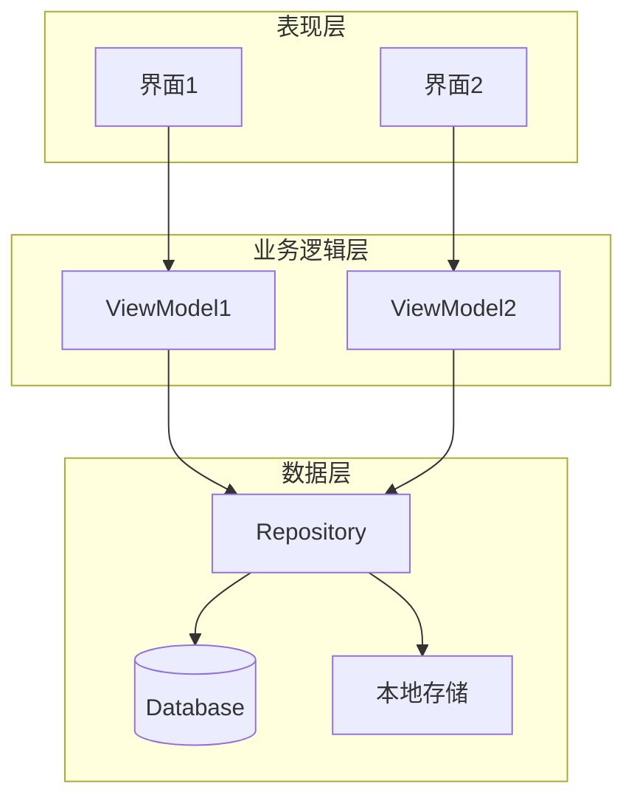
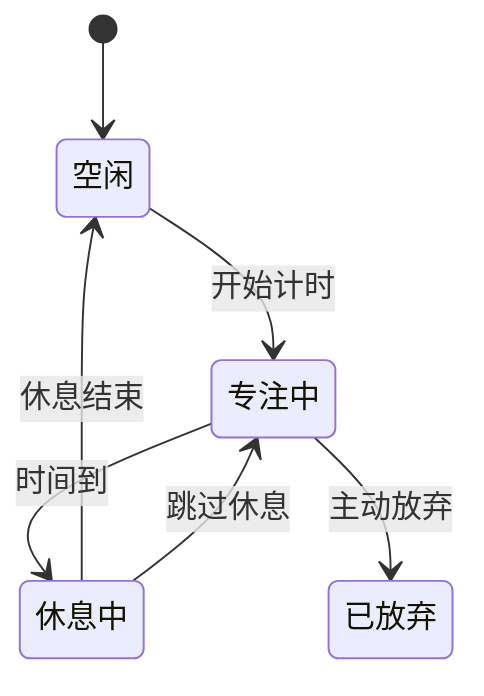
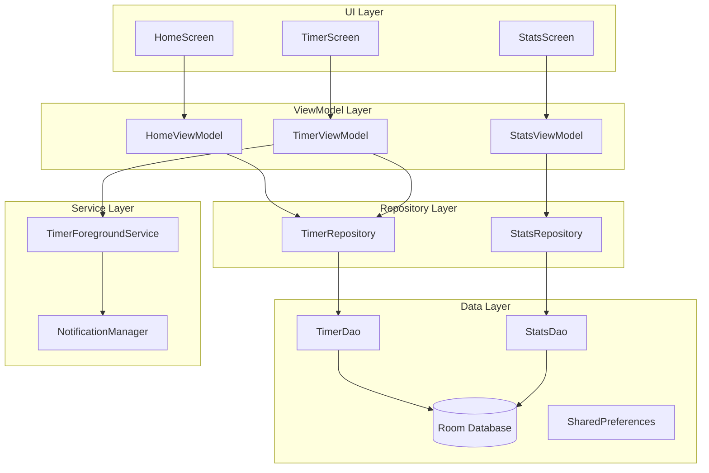
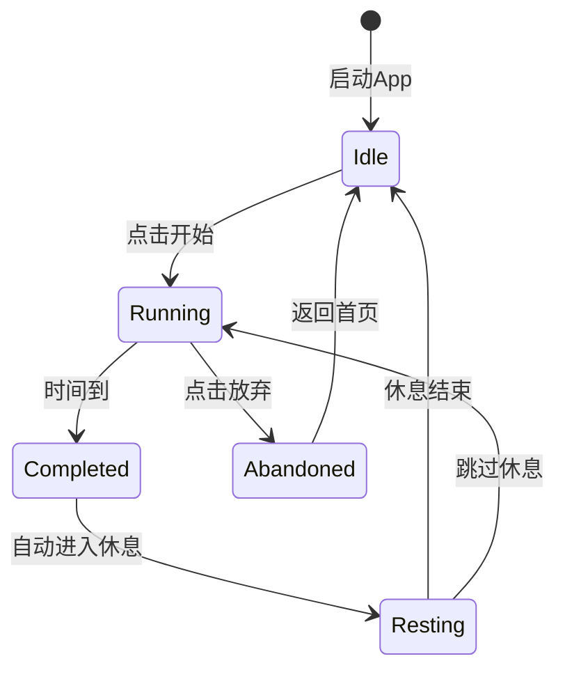

# 阶段9: 架构设计 (Architecture Design)

## 阶段目标
基于选定的技术方案，生成详细架构图。

## AI角色
**系统架构师** - 设计系统结构和数据流转

## 输出格式

```markdown
## 架构设计文档

### 选定的技术方案
[简要回顾选定的方案]

### 整体架构



### 模块划分

| 模块名 | 职责 | 关键类/文件 |
|--------|------|-------------|
| [模块1] | [职责描述] | [类名1, 类名2] |
| [模块2] | [职责描述] | [类名3, 类名4] |

### 数据模型

#### [实体1]
```kotlin
data class [实体名] {
    val id: String,
    val name: String,
    // ...其他字段
}
```

#### [实体2]
[同上]

### 状态流转



### 接口契约

#### [接口1]
```kotlin
interface [接口名] {
    suspend fun [方法名]([参数]): [返回类型]
}
```

### 依赖关系

```
模块A
├── 依赖: 模块B
├── 依赖: 模块C
└── 被依赖: 模块D
```
```

## 示例

```markdown
## 架构设计文档: 番茄钟App

### 选定的技术方案
原生Android + Kotlin + Jetpack Compose + Room

### 整体架构



### 模块划分

| 模块名 | 职责 | 关键类/文件 |
|--------|------|-------------|
| ui.home | 首页UI和逻辑 | HomeScreen, HomeViewModel |
| ui.timer | 计时中UI和逻辑 | TimerScreen, TimerViewModel |
| ui.stats | 统计UI和逻辑 | StatsScreen, StatsViewModel |
| data.repository | 数据操作 | TimerRepository, StatsRepository |
| data.local | 本地存储 | AppDatabase, TimerDao, StatsDao |
| service | 后台服务 | TimerForegroundService |

### 数据模型

#### TimerSession (计时会话)
```kotlin
@Entity(tableName = "timer_sessions")
data class TimerSession(
    @PrimaryKey val id: String = UUID.randomUUID().toString(),
    val taskName: String,
    val durationMinutes: Int,
    val startTime: Long,
    val endTime: Long?,
    val status: TimerStatus, // RUNNING, COMPLETED, ABANDONED
    val createdAt: Long = System.currentTimeMillis()
)

enum class TimerStatus {
    RUNNING,
    COMPLETED,
    ABANDONED
}
```

#### DailyStats (每日统计)
```kotlin
@Entity(tableName = "daily_stats")
data class DailyStats(
    @PrimaryKey val date: String, // yyyy-MM-dd
    val completedCount: Int,
    val abandonedCount: Int,
    val totalFocusMinutes: Int
)
```

### 状态流转



### 接口契约

#### TimerRepository
```kotlin
interface TimerRepository {
    suspend fun createSession(taskName: String, duration: Int): TimerSession
    suspend fun completeSession(sessionId: String)
    suspend fun abandonSession(sessionId: String, reason: String?)
    fun getRunningSession(): Flow<TimerSession?>
    suspend fun getSessionHistory(): List<TimerSession>
}
```

#### StatsRepository
```kotlin
interface StatsRepository {
    suspend fun getTodayStats(): DailyStats
    suspend fun updateTodayStats(change: StatsChange)
    suspend fun getWeeklyStats(): List<DailyStats>
}
```

### 依赖关系

```
ui
├── viewmodel
│   ├── repository
│   │   ├── data.local
│   │   └── service
```
```

## 注意事项

1. **使用标准架构模式** - MVVM/MVP/MVI等
2. **明确数据流向** - 单向数据流最佳
3. **状态机要完整** - 所有状态转换都要考虑
4. **接口契约清晰** - 输入输出要明确
5. **模块边界清晰** - 低耦合高内聚
