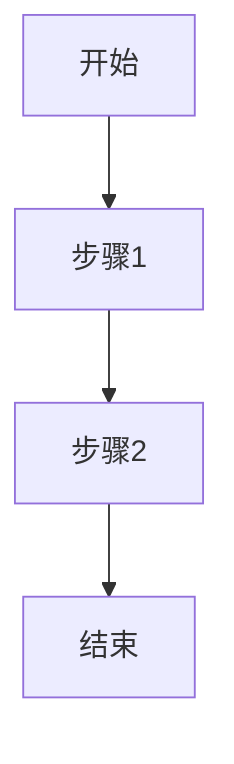
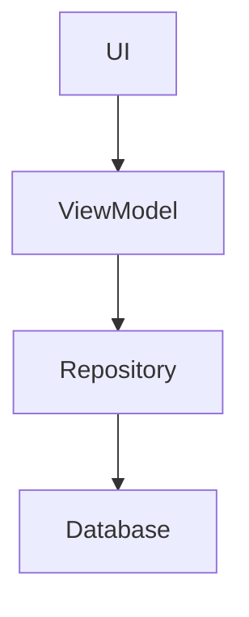

# 📄 [产品名称] 需求设计文档 (PRD)

**版本**: v1.0  
**日期**: YYYY-MM-DD  
**状态**: [草稿 / 评审中 / 已批准]  
**作者**: [作者]  

---

## 📋 文档导航

- [1. 产品概述](#1-产品概述)
- [2. 用户画像](#2-用户画像)
- [3. 竞品分析](#3-竞品分析)
- [4. 核心流程](#4-核心流程)
- [5. 功能规格](#5-功能规格)
- [6. UI设计](#6-ui设计)
- [7. 技术方案](#7-技术方案)
- [8. 风险评估](#8-风险评估)
- [9. 挑战记录](#9-挑战记录)
- [10. 测试策略](#10-测试策略)
- [11. 验收标准](#11-验收标准)
- [12. 附录](#12-附录)

---

## 1. 产品概述

### 1.1 产品定位
[一句话描述产品是什么，解决什么问题]

### 1.2 核心价值主张
- **对于用户**: [用户获得什么价值]
- **对于市场**: [市场定位]

### 1.3 成功指标
- [ ] 指标1: [如何衡量]
- [ ] 指标2: [如何衡量]

---

## 2. 用户画像

| 维度 | 描述 |
|------|------|
| 目标用户 | [具体描述] |
| 用户年龄 | [年龄段] |
| 技术水平 | [新手/中级/专家] |
| 使用场景 | [场景描述] |
| 核心痛点 | [痛点描述] |
| 用户目标 | [用户想通过产品达成什么] |

### 2.1 用户故事
**作为** [用户角色]  
**我想要** [功能]  
**从而** [获得的价值]

---

## 3. 竞品分析

### 3.1 参考竞品
[如果有，列出竞品及差异化策略]

### 3.2 竞品对比

| 竞品 | 核心功能 | 优点 | 缺点 | 我们的差异化 |
|------|----------|------|------|--------------|
| [竞品A] | [功能] | [优点] | [缺点] | [差异化] |
| [竞品B] | [功能] | [优点] | [缺点] | [差异化] |

---

## 4. 核心流程

### 4.1 主流程图


### 4.2 流程步骤说明

| 步骤 | 说明 | 用户操作 | 系统响应 |
|------|------|----------|----------|
| 1 | [描述] | [操作] | [响应] |
| 2 | [描述] | [操作] | [响应] |

---

## 5. 功能规格

### 5.1 功能清单 (MoSCoW)

#### Must Have (必须有)
- [ ] F-001: [功能名] - [描述]
- [ ] F-002: [功能名] - [描述]

#### Should Have (应该有)
- [ ] F-003: [功能名] - [描述]
- [ ] F-004: [功能名] - [描述]

#### Could Have (可以有)
- [ ] F-005: [功能名] - [描述]

### 5.2 详细功能规格

#### F-001: [功能名]

**功能描述**: [一句话描述]

**输入定义**

| 字段名 | 类型 | 必填 | 约束条件 | 默认值 |
|--------|------|------|----------|--------|
| [字段] | [类型] | [是/否] | [约束] | [默认值] |

**输出定义**

| 字段名 | 类型 | 说明 | 成功时 | 失败时 |
|--------|------|------|--------|--------|
| [字段] | [类型] | [说明] | [值] | [值] |

**边界条件**
1. [边界1]: [描述] → [处理方式]
2. [边界2]: [描述] → [处理方式]

**验收标准 (Given-When-Then)**

```
AC1: [场景名称]
Given: [前置条件]
When: [用户操作]
Then: [结果1]
  And: [结果2]
```

**测试要点**
- Happy Path: [描述]
- 异常场景: [描述]
- 边界测试: [描述]

**相关UI**: [组件列表]

---

## 6. UI设计

### 6.1 页面清单

| 页面ID | 页面名 | 功能说明 | 入口 |
|--------|--------|----------|------|
| P-001 | [页面名] | [说明] | [入口] |

### 6.2 设计规范

#### 颜色规范
| 用途 | 颜色值 | 说明 |
|------|--------|------|
| 主色 | #XXXXXX | [说明] |
| 背景 | #XXXXXX | [说明] |

#### 字体规范
| 用途 | 字号 | 字重 | 颜色 |
|------|------|------|------|
| 标题 | XXsp | Bold | [颜色] |
| 正文 | XXsp | Normal | [颜色] |

#### 间距规范
| 元素 | 间距 |
|------|------|
| 页面边距 | XXdp |

### 6.3 页面详细设计

#### P-001: [页面名]

**组件清单**

| 组件ID | 组件名 | 类型 | 属性 | 状态 | 交互 |
|--------|--------|------|------|------|------|
| C-001 | [名称] | [类型] | [属性] | [状态] | [交互] |

---

## 7. 技术方案

### 7.1 选定方案
[方案概述]

### 7.2 技术栈

| 组件 | 技术 | 版本 | 用途 |
|------|------|------|------|
| [组件] | [技术] | [版本] | [用途] |

### 7.3 架构设计



### 7.4 数据模型

```kotlin
data class [实体名](
    val id: String,
    // ...
)
```

---

## 8. 风险评估

| 风险ID | 风险描述 | 影响 | 概率 | 等级 | 缓解措施 |
|--------|----------|------|------|------|----------|
| R-001 | [描述] | [高/中/低] | [高/中/低] | [高/中/低] | [措施] |

---

## 9. 挑战记录

### 挑战1: [问题描述]
**发现的问题**: [描述]  
**解决方案**: [方案]

---

## 10. 测试策略

### 10.1 测试范围
- 单元测试: [范围]
- 集成测试: [范围]
- E2E测试: [范围]

### 10.2 测试用例映射
| 功能ID | 测试文件 |
|--------|----------|
| F-001 | [文件路径] |

---

## 11. 验收标准

### 11.1 功能验收
- [ ] 所有Must Have功能实现并通过测试
- [ ] 所有Should Have功能实现并通过测试（可选）
- [ ] 核心流程跑通

### 11.2 非功能验收
- [ ] 性能指标达标
- [ ] 无重大bug
- [ ] UI还原度 ≥ 90%

---

## 12. 附录

### 12.1 术语表
| 术语 | 定义 |
|------|------|
| [术语] | [定义] |

### 12.2 变更日志
| 版本 | 日期 | 变更内容 | 作者 |
|------|------|----------|------|
| v1.0 | [日期] | 初始版本 | [作者] |

---

## ✅ 批准状态

**设计文档状态**: ⬜ 待批准 / ✅ 已批准

**批准人**: ___________

**批准日期**: ___________

**备注**: ___________

---

*本文档由 sop-design Skill 生成*
